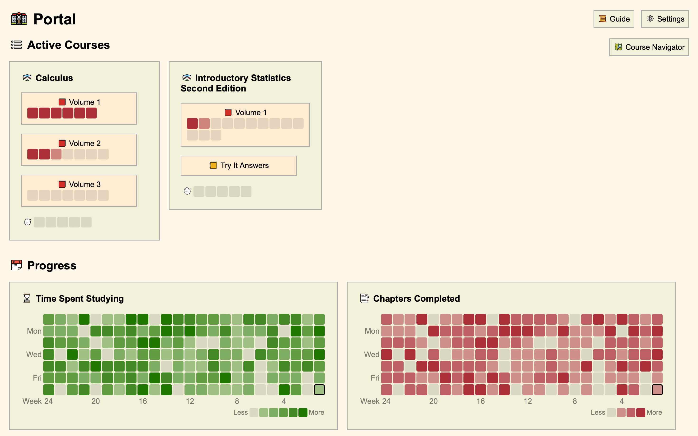
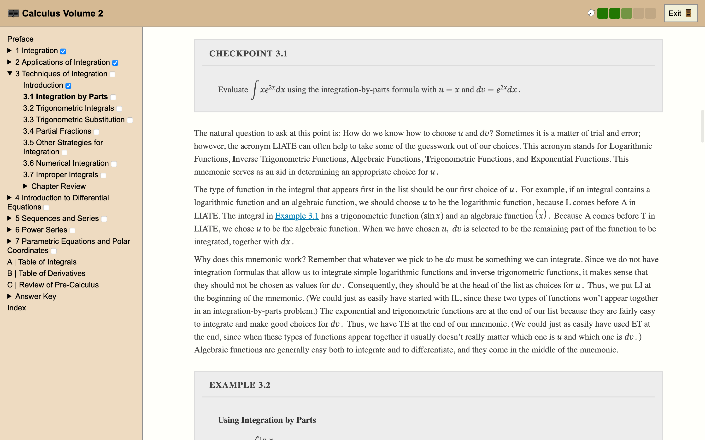
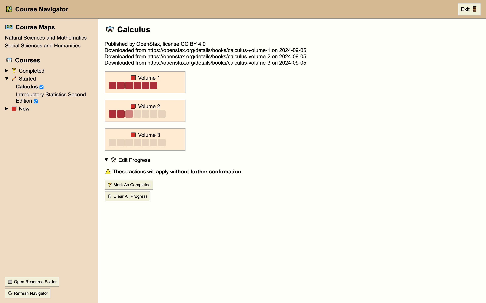
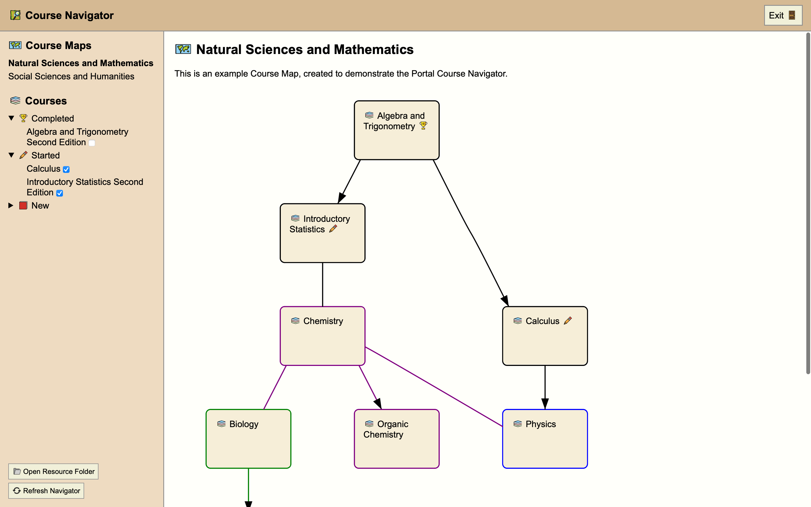

# Portal

Portal is an app built for independent learners.

Unlike most eLearning applications, Portal is focused on making use of existing learning materials. Any textbook or set of textbooks can be converted into a Portal course, as long as it is available in the EPUB format.

Portal is designed to perform well on low-end hardware and does not require an internet connection to use. It can run on Windows >= 7, macOS >= 12, and popular Linux distributions.

Screenshots

## Binary Installation

Binary releases of Portal can be found on the [releases page](https://github.com/School-of-Life-Project/Portal/releases), and installation instructions can be found on [Portal's website](https://school-of-life-project.github.io/Portal/).

## Building

You will need [Rust](https://www.rust-lang.org/tools/install) and [Node.js](https://nodejs.org/en/download) to build this application. In addition, you will need to install the build dependencies for [Tauri](https://v2.tauri.app/start/prerequisites/).

After installing the required dependencies, run `npm install` in the repository folder.

Then, you can:
- run the application in development mode with `npx tauri dev`
- build an optimized desktop binary with `npx tauri build`

### Hardening

By default, Courses can run arbitrary javascript. Although the application frontend is sandboxed, it is possible that malicious javascript could escape the sandbox and compromise the system's security.

If you are planning on running Portal in a high-risk environment, you may want to compile a hardened build to disable javascript in the Textbook Viewer (at the expense of breaking some Courses). You can do so by running `sh harden.sh` before compiling the application with `npx tauri build`.

To validate that you were running a hardened build, press the `⚙️ Settings` button on the app's home screen. The application version should no longer be displayed.

## Usage

Portal has a built-in user manual, which can be accessed by pressing the `📜 Guide` button on the app's home screen.

## Architecture

Portal is built using [Tauri](https://tauri.app) and [Vite](https://vitejs.dev).

The Rust-based backend of the application is used to load resources from disk and manage the state of the [embedded database](https://github.com/spacejam/sled). The TypeScript-based frontend of the application is used to render UI elements and display textbooks using [epub.js](https://github.com/futurepress/epub.js/).

UI icons are provided by [OpenMoji](https://openmoji.org). Fonts are provided by the system on Windows and MacOS, and mix of system fonts and custom fonts are used on Linux. On Linux, [Liberation Fonts](https://github.com/liberationfonts/liberation-fonts) are used for the UI.

Portal is a work in progress. View the [development task tracker](https://github.com/orgs/School-of-Life-Project/projects/1) to see what's being worked on.